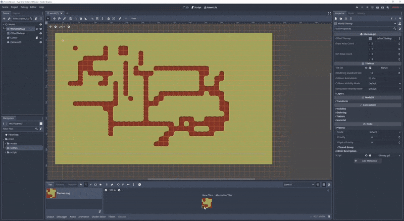
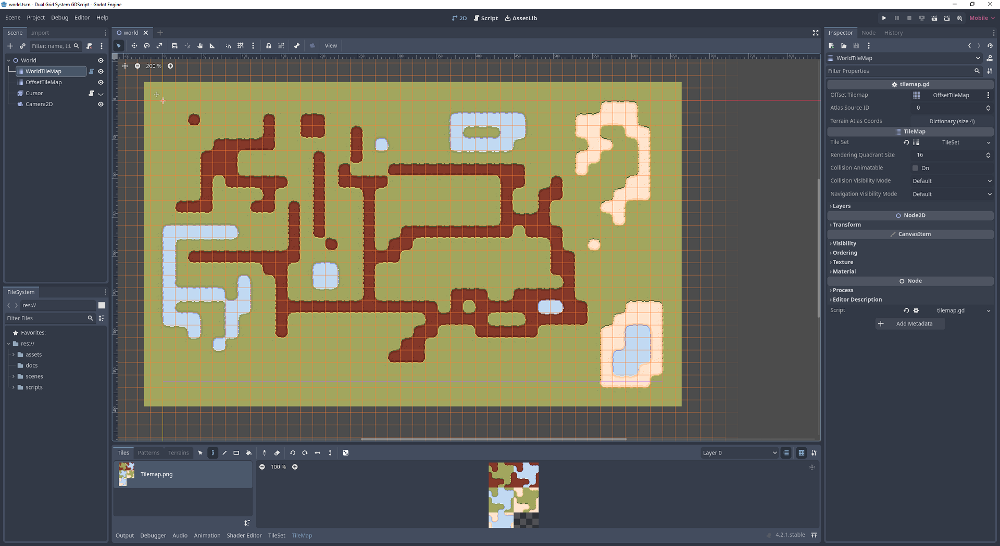

## Dual Grid Tilemap System For Godot In GDScript

A converted version of [jess::codes' C# dual grid system repo](https://github.com/jess-hammer/dual-grid-tilemap-system-godot) into native GDScript.

<b> Draw directly in the Editor with any of the fully filled tilemap tiles to see the changes! </b>

### Features
- Draw in the Editor
- Supports multiple terrains
  - Grass
  - Dirt
  - Water
  - Sand
- Easily add new terrain types
- Draw from multiple atlas coords

Using a dual grid system has the following advantages:
- Only 16 (or 6) tiles are required in the tileset
- The tiles have perfectly rounded corners
- The tiles align to the world grid

### References
- [Dual grid Twitter post by Oskar Stålberg](https://x.com/OskSta/status/1448248658865049605)
- ['Programming Terrain Generation' video by ThinMatrix](https://www.youtube.com/watch?v=buKQjkad2I0)
- ['Drawing Fewer Tiles' video by jess::codes](https://www.youtube.com/watch?v=jEWFSv3ivTg)

### Contributing
If you’d like to contribute, please see the [Contributing Guidelines](https://github.com/GlitchedinOrbit/dual-grid-tilemap-system-godot-gdscript/blob/main/CONTRIBUTING.md).

If you have any feedback, feel free to contact me on [Twitter](https://twitter.com/glitchedinorbit) or at glitchedinorbit[at]gmail.com

